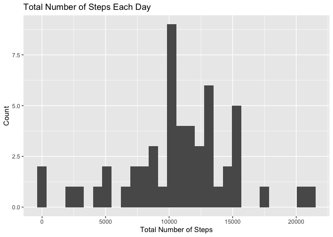
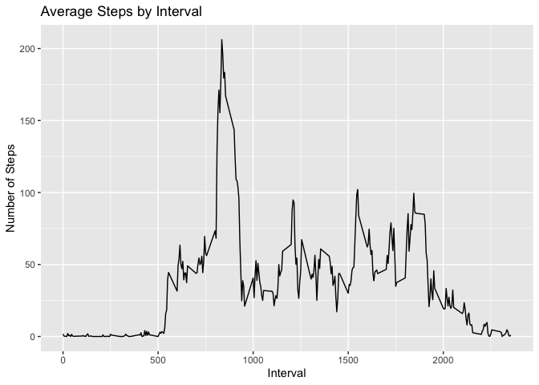
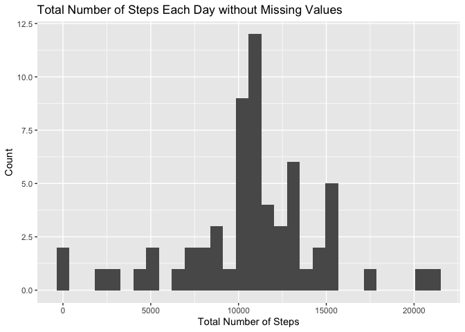
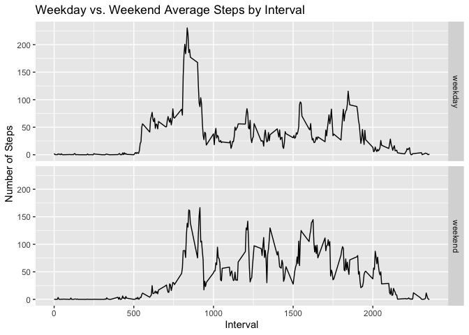

## Project Introduction

> This assignment makes use of [data](https://d396qusza40orc.cloudfront.net/repdata%2Fdata%2Factivity.zip) from a personal activity monitoring device. This device collects data at 5 minute intervals through out the day. The data consists of two months of data from an anonymous individual collected during the months of October and November, 2012 and include the number of steps taken in 5 minute intervals each day.

## Dataset Information

The variables included in this dataset are:  
- **steps:** Number of steps taking in a 5-minute interval (missing values are coded as NA)  
- **date:** The date on which the measurement was taken in YYYY-MM-DD format  
- **interval:** Identifier for the 5-minute interval in which measurement was taken  
The dataset is stored in a comma-separated-value (CSV) file and there are a total of 17,568 observations in this dataset.

## Data Processing

In the following section, I will be breakdown each step that I run through for processing the data.

### Loading and preprocessing the data

First, I will load the data into R.

```r
library(data.table)

url <- "https://d396qusza40orc.cloudfront.net/repdata%2Fdata%2Factivity.zip"
if (!file.exists("activity.zip")){
  download.file(url, destfile = "activity.zip", method = "curl")
  unzip("activity.zip")
  }
data <- fread("activity.csv", na.strings = "NA")
```

Then, I will transform the classes of the variables.

```r
data$date <- as.Date(data$date)
```

### What is mean total number of steps taken per day?

1. Make a histogram of the total number of steps taken each day

```r
library(ggplot2)
library(dplyr)
```

```r
sorteddata <- data %>% group_by(date) %>% summarise(Total = sum(steps))

ggplot(sorteddata, aes(Total)) + geom_histogram() + 
  labs(title = "Total Number of Steps Each Day", 
       x = "Total Number of Steps", y = "Count")
```

```
## `stat_bin()` using `bins = 30`. Pick better value with `binwidth`.
```

```
## Warning: Removed 8 rows containing non-finite values (stat_bin).
```

<!-- -->

2. Calculate and report the mean and median total number of steps taken per day

```r
totalmean <- round(mean(sorteddata$Total, na.rm = TRUE), 2)
totalmedian <- median(sorteddata$Total, na.rm = TRUE)
paste("The mean is", totalmean)
```

```
## [1] "The mean is 10766.19"
```

```r
paste("The median is", totalmedian)
```

```
## [1] "The median is 10765"
```

### What is the average daily activity pattern?

1. Make a time series plot of the 5-minute interval (x-axis) and the average number of steps taken, averaged across all days (y-axis)

```r
sorteddata2 <- data %>% group_by(interval) %>% 
  summarise(Average = mean(steps, na.rm = TRUE))
ggplot(sorteddata2, aes(interval, Average)) + geom_line() + 
  labs(title = "Average Steps by Interval", x = "Interval", y = "Number of Steps")
```

<!-- -->

2. Which 5-minute interval, on average across all the days in the dataset, contains the maximum number of steps?

```r
paste("The interval with maximum average steps is", 
      arrange(sorteddata2, desc(Average))[1, 1])
```

```
## [1] "The interval with maximum average steps is 835"
```

### Imputing missing values

1. Calculate and report the total number of missing values in the dataset

```r
paste("The total number of missing values is", nrow(data[is.na(steps), ]))
```

```
## [1] "The total number of missing values is 2304"
```

2. Devise a strategy for filling in all of the missing values in the dataset. The strategy does not need to be sophisticated. For example, you could use the mean/median for that day, or the mean for that 5-minute interval, etc.

**Use the mean of that 5-minute interval to fill in the missing values.**

3. Create a new dataset that is equal to the original dataset but with the missing data filled in.

```r
datawona <- data
for (i in 1:nrow(datawona)) {
  if (is.na(datawona[i, 1])) {
    datawona[i, 1] <- round(filter(sorteddata2, 
                                   interval == as.integer(datawona[i, 3]))[1, 2], 0)
  }
}
```

4. Make a histogram of the total number of steps taken each day and calculate and report the mean and median total number of steps taken per day. Do these values differ from the estimates from the first part of the assignment? What is the impact of imputing missing data on the estimates of the total daily number of steps?

The total number histogram:

```r
sorteddatawona <- datawona %>% group_by(date) %>% summarise(Total = sum(steps))

ggplot(sorteddatawona, aes(Total)) + geom_histogram() + 
  labs(title = "Total Number of Steps Each Day without Missing Values", 
       x = "Total Number of Steps", y = "Count")
```

```
## `stat_bin()` using `bins = 30`. Pick better value with `binwidth`.
```

<!-- -->

The mean and median:

```r
totalmeanwona <- round(mean(sorteddatawona$Total, na.rm = TRUE), 2)
totalmedianwona <- median(sorteddatawona$Total, na.rm = TRUE)
paste("The mean is", totalmeanwona)
```

```
## [1] "The mean is 10765.64"
```

```r
paste("The median is", totalmedianwona)
```

```
## [1] "The median is 10762"
```

The mean w/missing values in the dataset was 10766, the new mean is 10765.  
The median w/missing values in the dataset was 10765, the new median is 10762.  
So, indeed, the difference seems to be minimum.  
Thus, the impact of imputing missing values also seems to be minimum.

### Are there differences in activity patterns between weekdays and weekends?
1. Create a new factor variable in the dataset with two levels -- "weekday" and "weekend" indicating whether a given date is a weekday or weekend day.

```r
datawona$wday <- weekdays(datawona$date)

datawona[wday == "Saturday" | wday == "Sunday"]$wday <- "weekend"
datawona[wday != "weekend"]$wday <- "weekday"

datawona$wday <- as.factor(datawona$wday)
```

2. Make a panel plot containing a time series plot of the 5-minute interval (x-axis) and the average number of steps taken, averaged across all weekday days or weekend days (y-axis).

```r
sorteddatawona2 <- datawona %>% group_by(wday, interval) %>% 
  summarize(Average = mean(steps))
ggplot(sorteddatawona2, aes(interval, Average)) + geom_line() + facet_grid(wday ~ .) + 
  labs(title = "Weekday vs. Weekend Average Steps by Interval", 
       x = "Interval", y = "Number of Steps")
```

<!-- -->

## Summary

This document is solely created for study purposes.  
If you would like to further discuss any alternative methods in finishing the assignment, please feel free to reach out.
